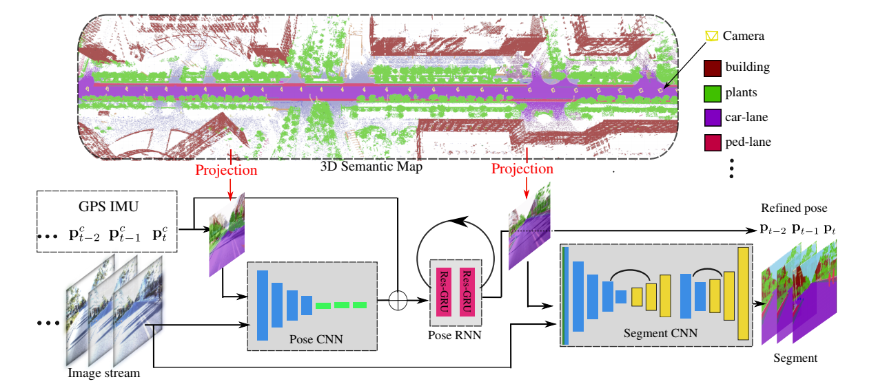

# DeLS-3D
The code for DeLS-3D of CVPR 2018 and the jounal paper, website: [Apolloscape Dataset](apolloscape.auto).

```
    @inproceedings{wang2018dels,
        title={DeLS-3D: Deep Localization and Segmentation with a 3D Semantic Map},
        author={Wang, Peng and Yang, Ruigang and Cao, Binbin and Xu, Wei and Lin, Yuanqing},
        booktitle={CVPR},
        pages={5860--5869},
        year={2018}
    }

    @article{huangwang2018_apolloscape,
        author    = {Xinyu Huang and
                   Peng Wang and
                   Xinjing Chen and
                   Qichuan Geng and
                   Dingfu Zhou and
                   Ruigang Yang},
        title     = {The ApolloScape Open Dataset for Autonomous Driving and its Application},
        journal   = {CoRR},
        volume    = {abs/1803.06184},
        year      = {2018}
    }

```




## Log:
- zpark testing code is ready to use.
- Dataset of zpark & dlake are availabe


## Dependents

Our system depends on:

API that supporting rendering of 3D points to label maps and depth maps:
[apolloscape-api](https://github.com/ApolloScapeAuto/dataset-api).

Various API that supporting many 3D applications
[vis_utils](https://github.com/pengwangucla/vis_utils)

Tested with Ubuntu 14.04 for rendering , python version 2.7.5, mxnet 0.11 for training.

If you need to train:
We use the code for augmentation:
[imgaug](https://github.com/aleju/imgaug)


# Dataset
Each part of the dataset are including, `images`, `camera_pose`, `semantic_label`, `semantic_3D_points`, `split`. 

| Data | `images`, `camera_pose`, `split`, `semantic_label` | `semantic_3D_points` | 'Video'|
|:-:|:-:|:-:|:-:|
|`Zpark`| [Download](https://ad-apolloscape.bj.bcebos.com/DeLS3D/zpark_2D.tar.gz) |  [Download](https://ad-apolloscape.bj.bcebos.com/DeLS3D/zpark_3D.tar.gz) | [Watch](https://www.youtube.com/watch?v=M6lhkzKFEhA)|
|`Dlake`| [Download](https://ad-apolloscape.bj.bcebos.com/DeLS3D/dlake_2D.tar.gz) |  [Download](https://ad-apolloscape.bj.bcebos.com/DeLS3D/dlake_3D.tar.gz) | Watch |

Results videos:

[Zpark](https://www.youtube.com/watch?v=HNPQVtgpjbE)

[Dlake](https://www.youtube.com/watch?v=ApyqPnvmJAs&t=1s)


Notice Dlake data is a subset of official released data [road01_inst.tar.gz](http://apolloscape.auto/scene.html) where you may obtain corresponding instance segmentation, depth and poses also. We do different split for train/val used in the paper. 

In addition, for semantic 3D points, we release a merged pcd file which is used for rendering label maps in the paper, 
we also have much denser point cloud that are separated stored for Dlake dataset. 

[comment]: # Download and unzip to folder `data`, perturbed poses are also provided for results reproducibility.
Download and unzip to folder `data`. 

# Testing
Notice the number of the pre-trained models could be slightly different than that from paper due to the randomness from perturbation of GPS/IMU, but it should be close.

`source.rc` Firstly, pull the dependents and source the corresponding root folders


## Download pre-trained models

Zpark: [Download](https://drive.google.com/file/d/1i3Fl6c0k__9AfLd96CZgaffbY_0g5cgf/view?usp=sharing)

Dlake: Download

Download them and put under 'models/${Data}/' ${Data} is the corresponding dataset name. 

### Testing
Currently only zpark testing code is available

run the following code for test and evaluation of pose_cnn, pose_rnn, and seg_cnn. 

```Notice 
- the images has some area (face&plate) blurred due to security reasons, therefore the number output from our pretrained models are slightly different from that in paper. You may need to retrain the model for better performance.

- The test code does not have clipping pose inside road area as preprocessing indicated due to liscense issue
```

Download 


| Data | `noisy pose`|
|:-:|:-:|
|`Zpark`| [Link](https://ad-apolloscape.bj.bcebos.com/DeLS3D/noisy_pose.tar.gz)|
|`Dlake`| [Link](http://ad-apolloscape-hk.hk-2.bcebos.com/DeLS-3D/dlake/noisy_pose.tar.gz?authorization=bce-auth-v1%2F9683e90232684b3a89070eabd25cf047%2F2019-05-05T01%3A19%3A06Z%2F300%2Fhost%2Fad0f85ae5296dc5ecda77146eb6a9b1ceb0fd4363116ec0f6a8bfde3311652ee)|

put under 'results/${Data}/noisy_pose' 
You may also use the code to generate simulated noisy pose too. 


Set up the environment
```
source source.rc
```

```python
python test_DeLS-3D.py --dataset zpark --pose_cnn ./models/zpark/pose_cnn-0000 --pose_rnn models/zpark/pose_rnn-0000 --seg_cnn models/zpark/seg_cnn-0000
```

Should get results close to the paper with a random pose simulation. 
Notice current pipeline is an offline version, since CNN and RNN are not connected, one may need to reimplement for online version.


### Training
Some loss functions are uploaded but the pipeline need to be cleaned.
To be updated.


# Note
I may not have enough time for solving all your issues, expect delay of reply. 

Contact: wangpeng54@baidu.com

